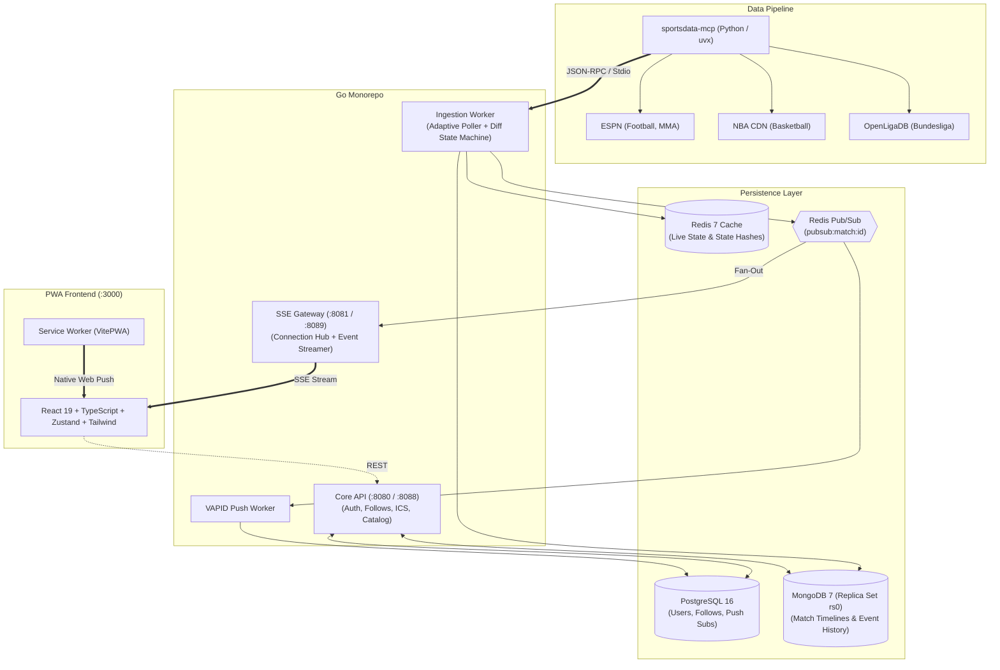

# not365 ⚡

[](https://github.com/NivRave/not365/actions/workflows/ci.yml)
[](https://go.dev/)
[](https://react.dev/)
[](https://www.typescriptlang.org/)
[](https://opensource.org/licenses/MIT)

A high-performance, real-time multi-sport **Progressive Web App (PWA)** delivering live scores, match timelines, personalized alerts, and calendar feeds — comparable to 365Scores.

Built on **Go**, **React 19**, and a free open-source sports data pipeline powered by [`sportsdata-mcp`](https://github.com/astral-sh/uv).

---

## 🌟 Key Features

- ⏱️ **Live Scores & Real-Time Streams**: HTTP/2 Server-Sent Events (SSE) fan-out delivering low-latency score ticks, game clocks, and timeline actions.
- 🔄 **Adaptive Ingestion Pipeline**: Ingestion state machine shifts dynamically (`IDLE` 30m, `PRE_MATCH` 5m, `LIVE` 15s) with SHA-256 state diffing to eliminate redundant broadcasts.
- 🔁 **Zero-Loss Reconnect Sync**: SSE reconnection support via `Last-Event-ID` that queries and replays missed chronological events from MongoDB.
- 📅 **Dynamic iCalendar Sync (RFC 5545)**: Live personal calendar feed (`.ics`) for followed teams and leagues, importable into Apple Calendar, Google Calendar, and Outlook.
- 🔔 **Native VAPID Web Push**: Server-side Web Push notifications for match kick-offs, goals, and game-ending events.
- 📱 **Mobile-First PWA**: Offline-ready with service workers, installable to iOS and Android home screens.
- 🛠️ **Dev Auth Stub**: Built-in instant login mode (`AUTH_MODE=stub`) allowing full end-to-end development without registering OAuth client credentials.

---

## 🏗️ Architecture



---

## 🧰 Tech Stack

| Layer | Technology |
|---|---|
| **Backend Languages** | Go 1.25+ |
| **API Framework** | `go-chi/chi/v5` |
| **Relational Database** | PostgreSQL 16 (`jackc/pgx/v5` connection pool) |
| **Document Store** | MongoDB 7 (Single-node replica set `rs0` for multi-doc ACID transactions) |
| **Cache & Pub/Sub** | Redis 7 (`redis/go-redis/v9`) |
| **Push Notifications** | Native VAPID Web Push (`SherClockHolmes/webpush-go`) |
| **Frontend Framework** | React 19, TypeScript, Vite, Tailwind CSS |
| **State Management** | Zustand (with optimistic updates) |
| **PWA & Offline** | `vite-plugin-pwa` with Workbox runtime caching |
| **Data Ingestion** | `sportsdata-mcp` (via stdio JSON-RPC or resilient HTTP fallback) |

---

## 🚀 Getting Started

### Prerequisites

Ensure you have the following installed:
- [Docker & Docker Compose](https://www.docker.com/) (v24+)
- [Go](https://go.dev/) (v1.23+)
- [Node.js](https://nodejs.org/) (v22+) and [pnpm](https://pnpm.io/) (`npm i -g pnpm`)
- [uv / Python](https://docs.astral.sh/uv/) (`pip install uv`)

---

### Option A: Run Full Stack via Docker (Easiest)

Spin up all backing databases, Go microservices, and the React PWA with one command:

```bash
# 1. Clone repository
git clone https://github.com/NivRave/not365.git
cd not365

# 2. Setup environment variables
cp .env.example .env

# 3. Start everything in Docker
docker compose --profile app up -d --build
```

Access the services:
- **PWA Frontend**: [http://localhost:3000](http://localhost:3000)
- **Core API Health**: [http://localhost:8088/health](http://localhost:8088/health)
- **SSE Gateway Health**: [http://localhost:8089/health](http://localhost:8089/health)

---

### Option B: Local Development Workflow

#### 1. Start Backing Stores
Start PostgreSQL, MongoDB (with automated replica set initiation), and Redis:
```bash
docker compose up -d
```

Verify containers are healthy:
```bash
docker compose ps
```

#### 2. Run Database Migrations
Apply PostgreSQL schema:
```bash
Get-Content backend/db/migrations/001_initial.sql -Raw | docker exec -i not365-postgres psql -U not365 -d not365
```

#### 3. Run Backend Services
In separate terminal windows:
```bash
# Core API
cd backend
go run ./cmd/api

# SSE Gateway
cd backend
go run ./cmd/gateway

# Ingestion Worker
cd backend
go run ./cmd/worker
```

#### 4. Run Frontend Dev Server
```bash
cd frontend
pnpm install
pnpm dev
```
Open [http://localhost:3000](http://localhost:3000). The Vite dev server automatically proxies `/v1/` and `/auth/` to the Core API (`:8088`) and `/v1/sse/` to the SSE Gateway (`:8089`).

---

## 📡 API Reference

### Core API (`:8088` or `:8080`)

| Method | Endpoint | Description | Auth |
|---|---|---|---|
| `GET` | `/health` | Service health status | Public |
| `POST` | `/auth/dev-login` | Instant dev-mode login (issues JWT) | Public |
| `POST` | `/auth/refresh` | Refresh expired JWT session | Public |
| `DELETE` | `/auth/session` | Invalidate current session | Public |
| `GET` | `/v1/sports` | List supported sports (Football, Basketball, MMA) | Public |
| `GET` | `/v1/sports/{sport}/leagues` | List leagues under a sport | Public |
| `GET` | `/v1/matches?sport={sport}` | Today's & upcoming matches | Public |
| `GET` | `/v1/matches/{id}` | Detailed match timeline & statistics | Public |
| `GET` | `/v1/matches/{id}/sync?since={seq}`| Fetch missed events since sequence | Public |
| `GET` | `/v1/calendar/{token}.ics` | RFC 5545 calendar feed for user's follows | Public |
| `GET` | `/v1/me` | Current authenticated user profile | Bearer JWT |
| `GET` | `/v1/me/follows` | List user's followed teams and leagues | Bearer JWT |
| `POST` | `/v1/me/follows` | Follow a team or league | Bearer JWT |
| `DELETE` | `/v1/me/follows/{id}` | Unfollow an entity | Bearer JWT |
| `POST` | `/v1/me/push` | Register browser VAPID push subscription | Bearer JWT |
| `DELETE` | `/v1/me/push` | Revoke push subscription | Bearer JWT |

### SSE Gateway (`:8089` or `:8081`)

| Method | Endpoint | Description |
|---|---|---|
| `GET` | `/health` | Gateway health check |
| `GET` | `/v1/sse/match/{id}` | Real-time HTTP/2 SSE stream (`match_snapshot`, `match_update`, `replay`) |

---

## 🧪 Testing & Validation

```bash
# Run all Go backend unit tests
make test

# Build all Go binaries and React frontend assets
make build

# Validate sports data MCP endpoints and reachability
make mcp-doctor

# Generate a fresh VAPID keypair
make vapid-keygen
```

---

## 📄 License

This project is licensed under the [MIT License](LICENSE).
